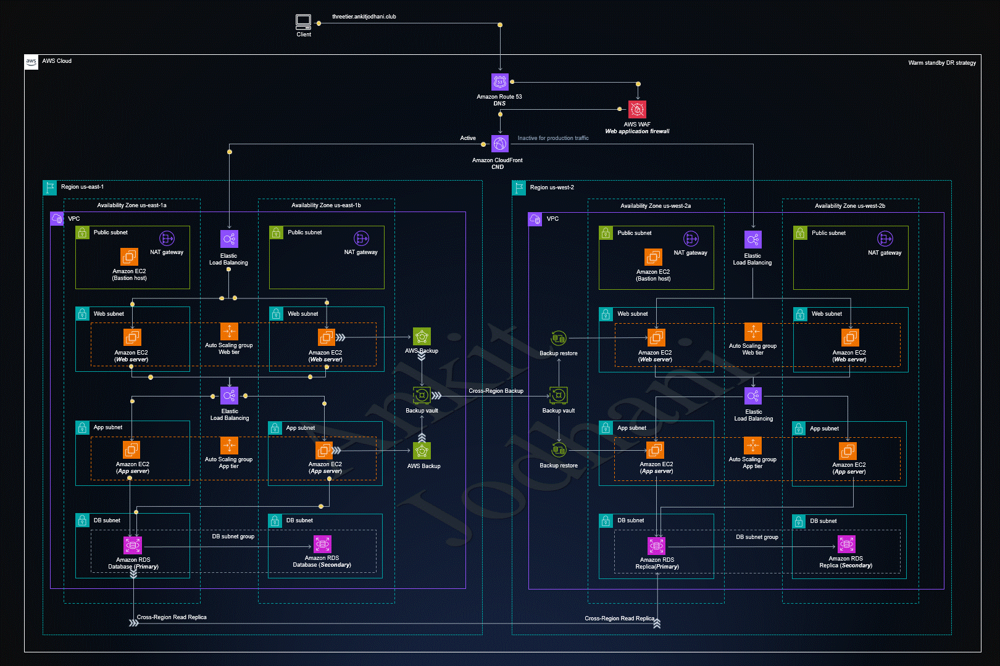

   # 🚀 2ndWeeksofCloudOps - 3 tier Application

✨This repository is created to learn and deploy  3-tier application on aws cloud. this project contain three layer Presentation, Application and database

## 🏠 Architecture


## Tech stack

- React 
- Nodejs
- MySQL

## 🖥️ Installation of frontend

**Note**: You should have nodejs installed on your system. [Node.js](https://nodejs.org/)

👉 let install dependency to run react application

```sh
cd client
npm install
```

**Note**: you have to change one file for backend API. you will find that `src/pages/config.js`

```sh
vim src/pages/config.js
```

```javascript
// const API_BASE_URL = "http://25.41.26.237:80"; // on live backend server which is running on port 80
const API_BASE_URL = "http://localhost:portNumber";
export default API_BASE_URL;
```
make sure you EDIT above file depends on your scenario


```sh
npm run build 
```

above command creat optimize build of the application in client folder. `build/` you will find all the files that you can serve through **Apache** or **Nginx**
that's the whole setup of the frontend

##  🖥️ ️Installation of backend

**Note**: You should have nodejs installed on your system. [Node.js](https://nodejs.org/)

👉 let install dependency to run Nodejs  API

```sh
cd backend
npm install
```
Now we need to create .env file that holds all the configuration details of the backend. you should be in backend directory

```sh
vim .env
```
add below content 

```javascript
DB_HOST=localhost or URL_of_RDS
DB_USERNAME=user_name_of_MySQL
DB_PASSWORD=passwod_of_my_sql
PORT=3306
```
**Note** : please change above file depending on your setup. like you may use RDS(AWS) or Local mysql-server on your system. your mysql contain database with the name of `test` and it should has `books` table. You can you test.sql to create table 


```sh
mysql -h <<RDS_ENDPOINT OR localhost>> -u <<USER_NAME>> -p<<PASSWORD>>

CREATE DATABASE test;

mysql -h <<RDS_ENDPOINT OR localhost>> -u <<USER_NAME>> -p<<PASSWORD>> test < test.sql
```


please install pm2 if you want to run on cloud. you may need sudo privilages to installed it because we are going to installed globally.

```sh
npm install -g pm2
```

now you can run this application. make sure you are in backend directory


```sh
pm2 start index.js --name "backendAPI"
```

above command will start node server on port 80, you can modify the port number in `index.js` file

✈️ Now we are Ready to see the application

**Thank you so much for reading..😅**
